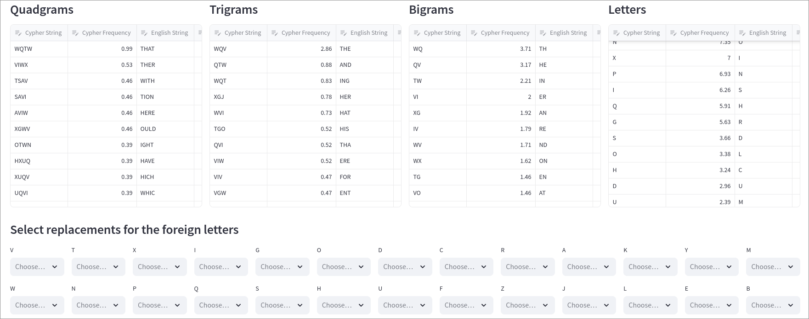
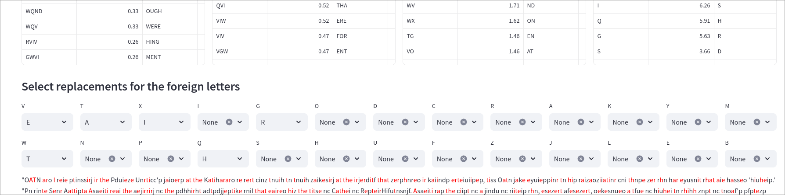
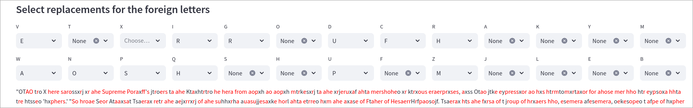
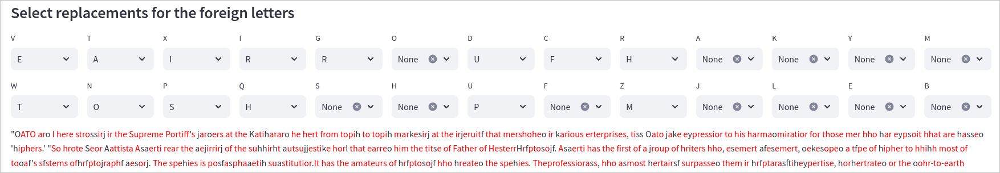
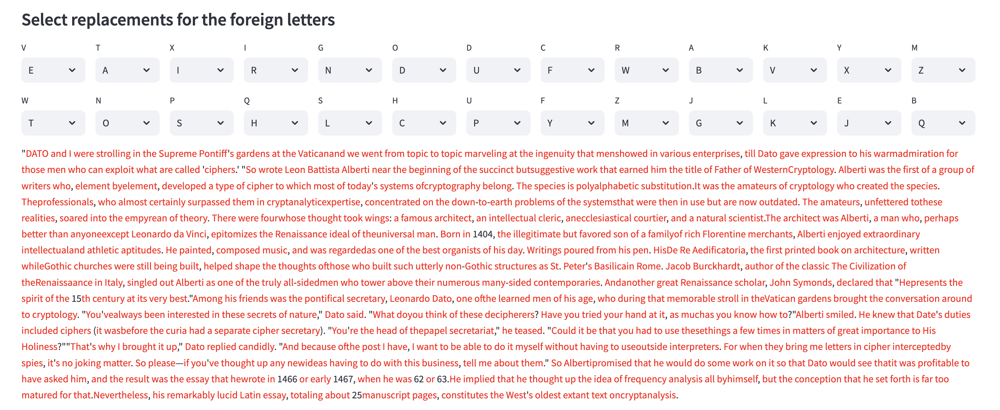

# Task Description

Build a small app that takes in some cyphertext and apply frequency analysis to decypher and find the original text. The original text is in English.

# Implementation
First, we can set the frequencies of English letters and add the frequencies of combinations of 2,3 and 4 letters to aid us in finding matches for the cyphertext. 
Then we should pass through the cyphertext and find the frequencies of all combinations of 1,2,3 and 4 letters. After that we sort both from the most to least frequent and match them by order. 
```python
def get_word_parts_frequencies(text: str = None,
            nr_of_letters: int = None, 
            max_parts: int = None):
    if text is None:
        raise ValueError("No text provided")
    if nr_of_letters is None:
        raise ValueError("No number of letters provided")

    words = text.split(" ")
    word_parts = [
        word[i:i+nr_of_letters].upper()
        for word in words for i in range(len(word) - nr_of_letters + 1)
        if word[i] in string.ascii_letters
    ]

    total_parts = len(word_parts)
    word_part_counts = Counter(word_parts)

    if max_parts is not None:
        word_part_counts = dict(
            sorted(word_part_counts.items(),
                   key=lambda item: item[1], reverse=True)[:max_parts]
        )

    word_part_info = {
        part: {'count': count, 'frequency': round(
            (count / total_parts)*100, 2)}
        for part, count in word_part_counts.items()
    }

    return word_part_info
```
This is a somewhat naive approach, since there are letters that are very close by their frequencies, but we will still use that.

# Decryption
## Step 1 - Replace most frequent letters

We see that the most frequent letter is V, which matches with E, and there are a lot of multiple letters combinations that match V with E too. So we will map the letter like this:
V -> E
W -> T
T -> A
## Step 2 - Grab onto something

After performing the first replacements, we can observe that the second word is "ago", and G matches with R by probability, so we could replace it. Then we see words like "tqe", and Q matches with H.
We can then see the phrase `cinz tnuih tn tnuih` where `cinz` could mean `from` and then is followed by some other phrase that repeats the letters. We can then for sure substitute `cinz` with `from`, which will uncover us many options for replacement.
## Step 3 - Simple replacements
 
We see then the word `thope`, where `p` looks like `s`. But there are some words that still look like gibberish. 

And now the word `Sdureme` looks like `Supreme`. 
We still see some strange words, but we observe the word `Ftaher of Hesaerr...` and it looks a lot like `Father`, especially capitalized. Then we can also see that in lots of places, X matches to I

And then we can observe words like `spehxes` that looks like `species`, `sfstems` looks like `systems`. By further substituting other letters, we get closer to the real text.

# Result
This is the final text in English obtained by replacing all foreign letters.
