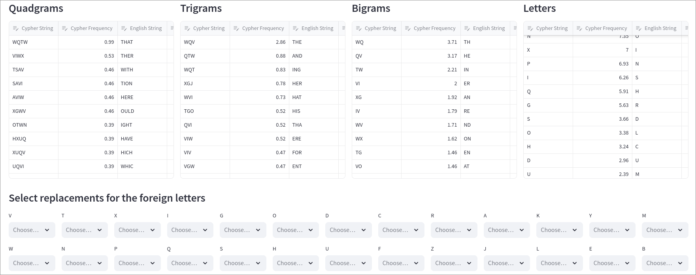
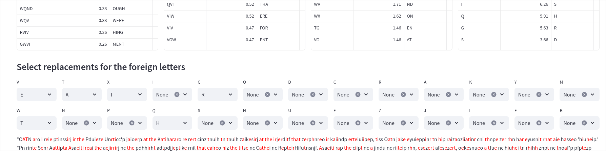
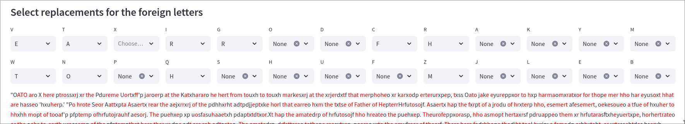
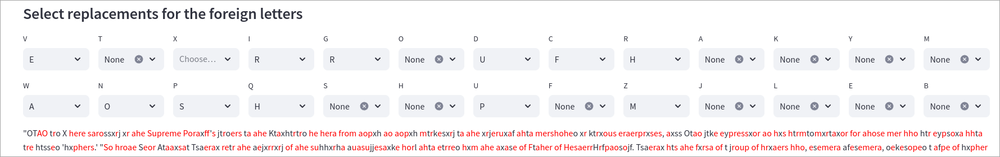
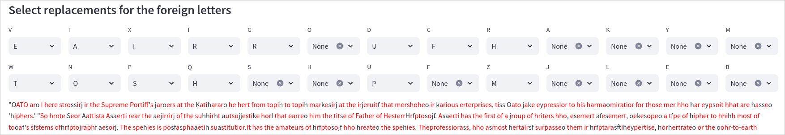

Now let's proceed on decrypting the cyphertext

We see that the most frequent letter is V, which matches with E, and there are a lot of multiple letters combinations that match V with E too.
We can proceed in this way with the most frequent letters and do
V -> E
W -> T
T -> A

After performing the first replacements, we can observe that the second word is "ago", and G matches with R by probability, so we could replace it. Then we see words like "tqe", and Q matches with H.
We can then see the phrase `cinz tnuih tn tnuih` where `cinz` could mean `from` and then is followed by some other phrase that repeats the letters. We can then for sure substitute `cinz` with `from`, which will unlock us many more other possibilities.
Now we have ```{'V': 'E', 'W': 'T', 'T': 'A', 'N': 'O', 'I': 'R', 'Q': 'H', 'G': 'R', 'C': 'F', 'R': 'H', 'Z': 'M'}```
 
We see then the word `thope`, where `p` looks like `s`. But there are some words that still look like gibberish. Let's remove some mappings we previously established, like T -> A.
And now the word `Sdureme` looks like `Supreme`. 

We still see some strange words, but we observe the word `Ftaher of Hesaerr...` and it looks a lot like `Father`, especially capitalized. Then we can also see that in lots of places, X matches to I

And then we can observe words like `spehxes` that looks like `species`, `sfstems` looks like `systems`

{'V': 'E', 'W': 'T', 'T': 'A', 'N': 'O', 'X': 'I', 'P': 'S', 'I': 'R', 'Q': 'H', 'G': 'R', 'H': 'C', 'D': 'U', 'U': 'P', 'C': 'F', 'F': 'Y', 'R': 'H', 'Z': 'M'}